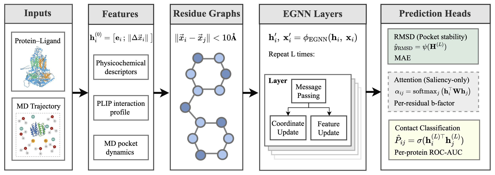

# PocketMotionGraph

**PocketMotionGraph** is a mechanism- and dynamics-informed deep learning framework for early-stage screening of protein–ligand stability using short-timescale molecular dynamics (MD). It focuses on **ABC transporters** from fungal pathogens relevant to antifungal resistance.

This repository contains the full codebase, dataset scripts, and trained models to reproduce the results from our paper.Due to the large size of the dataset (~4,500 protein–ligand spatiotemporal graphs), only a small subset of **demo graphs** are included in this repository under `dataset/data_graph_v3_f1/` for testing and development purposes. The full dataset will be avaiable soon.

## 🚀 Key Features

- **Benchmark Dataset**: 4,525 spatiotemporal residue-level graphs from 2 ns MD simulations across 240 druggable pockets from 16 ABC transporters.
- **End-to-End Framework**: Converts MD trajectories into graphs encoding pocket dynamics, residue interactions, and physicochemical features.
- **SE(3)-Equivariant Model**: Utilizes an E(n)-equivariant GNN (EGNN) for predicting ligand RMSD drift and classifying stable/unstable pockets.
- **Fast + Scalable**: Achieves robust performance using only 2 ns MD per pocket, reducing GPU cost by >50× compared to long MD baselines.
- **Biological Insight**: Attention maps highlight key functional residues (e.g., NBDs, TMHs) consistent with known transporter mechanisms.

---

## 📁 Repository Structure

